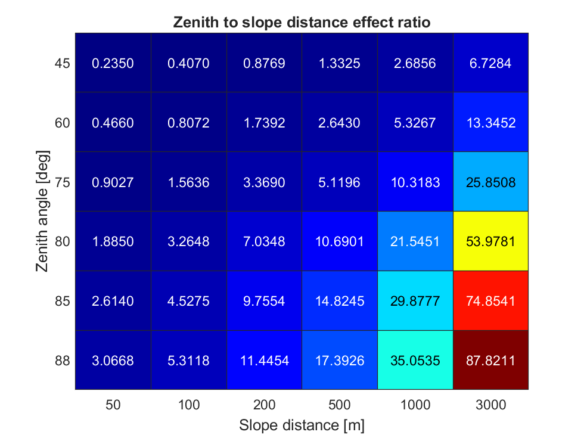

# total-station-sensitivity-analysis
A simple sensitivity analysis of trigonometric leveling with a total station.

## About
This script conducts a sensitivity analysis to examine the effect of zenith angle and slope distance on the resulting error in a vertical distance as observed by a total station. There are two functions defined inline that will perform the analysis analytically and via Monte Carlo analysis. At current, the Monte Carlo function is unused.

## How to use
The user needs to specify the *a priori* standard deviations of the total station to be analyzed, specifically the standard deviation in angular accuracy and the standard deviation of EDM accuracy + ppm error. The user must also specify a range of zenith angles and slope distances to test. These are currently the only two parameters used in the sensitivity analysis.

## Result
The result of the analysis is a heatmap which reports the **zenith-angle-to_slope-distance ratio**, which reports how much greater (ratio > 1) or less (ratio < 1) the zenith angle affects the resulting error. The resulting ratios for all initial test conditions are presented in a heatmap as shown above.

## How it works
The analysis uses SLOPOV to find the component of the resulting total error which can be contributed to slope distance and to zenith angle. SLOPOV assumes that the variables are uncorrelated; this is not strictly the case with slope distance and zenith angle. The correlation between the two, however, is considered small enough to be neglected for this simple analysis. In other words, the variances with respect to slope distance and to zenith angle are far greater than the covariance of the two, especially at any considerable slope distance (i.e., a slope distnace one might expect to observe in an actual survey).

## Acknowledgements
Víctor Martínez-Cagigal (2022). Custom Colormap (https://www.mathworks.com/matlabcentral/fileexchange/69470-custom-colormap), MATLAB Central File Exchange. Retrieved November 23, 2022. 
